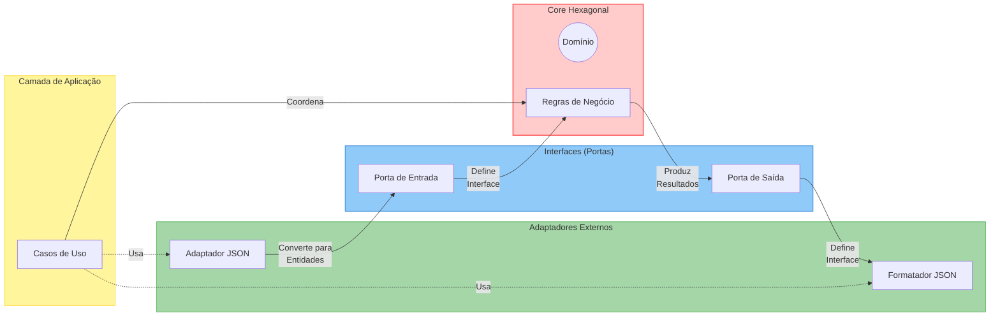

# 💰 Code Challenge: Ganho de Capital

Este projeto é uma solução para o Code Challenge sobre cálculo de ganho de capital, implementando um algoritmo que calcula o imposto a ser pago sobre lucros ou prejuízos de operações na bolsa de valores.

## 📑 Sumário

- [📋 Requisitos](#requisitos)
- [🏗️ Decisões Técnicas e Arquiteturais](#decisoes-tecnicas)
- [🛠️ Justificativa para Frameworks e Bibliotecas](#frameworks-bibliotecas)
- [🚀 Como Executar o Projeto](#como-executar)
- [🧪 Executando os Testes](#executando-testes)
- [📝 Notas Adicionais](#notas-adicionais)

<a id="requisitos"></a>

## 📋 Requisitos

- 🐍 Python 3.13.2
- 📦 Poetry 2.1.1
- 🐳 Docker (opcional)

<a id="decisoes-tecnicas"></a>

## 🏗️ Decisões Técnicas e Arquiteturais

### 💡 Filosofia de Design

Como especialista em Python, normalmente priorizaria uma abordagem mais pythônica e minimalista, seguindo o princípio KISS (Keep It Simple, Stupid). No entanto, considerando os objetivos deste Code Challenge de avaliar capacidades de desenvolvimento quanto à simplicidade, elegância, operacionalidade, qualidade, boas práticas e validação com testes, optei por uma arquitetura mais estruturada e extensível.

### 🔷 Arquitetura Escolhida: Hexagonal (Ports and Adapters)

Para este desafio, implementei a **Arquitetura Hexagonal** (também conhecida como Ports and Adapters) por oferecer:

- 🛡️ **Isolamento do domínio**: Mantém as regras de negócio de cálculo de impostos completamente isoladas
- ✅ **Testabilidade**: Facilita a escrita de testes unitários sem dependências externas
- 🧩 **Extensibilidade**: Permite adicionar novas interfaces e formatos sem modificar o núcleo da aplicação

Esta arquitetura é particularmente adequada para este cenário porque:

1. 🔄 Separa a lógica de entrada/saída (JSON) da lógica de negócio (cálculo de impostos)
2. 🔌 Facilita futuras extensões como novas interfaces (REST, GraphQL) ou formatos (XML, YAML)
3. 🔒 Mantém as regras de negócio centralizadas e protegidas de mudanças externas

#### Diagrama da Arquitetura Hexagonal



Este diagrama ilustra a implementação da arquitetura hexagonal no projeto, mostrando como o domínio central (com as regras de negócio) está isolado das dependências externas através de interfaces bem definidas, e como a camada de aplicação orquestra o fluxo entre os componentes.

> **Nota**: Para visualizar o diagrama Mermaid acima, é necessário:
>
> - Visualizar este README no GitHub, que suporta renderização nativa de Mermaid
> - Utilizar uma extensão como "Markdown Preview Mermaid Support" no VSCode
> - Ou acessar ferramentas online como [Mermaid Live Editor](https://mermaid.live/) para copiar e visualizar o código Mermaid

### 📊 Estrutura e Organização

O projeto segue uma estrutura baseada em camadas com responsabilidades bem definidas:

- 🧠 **Domain**: Contém as regras de negócio e entidades core

  - Entidades como `Operacao` e `TipoOperacao`
  - Regras de cálculo de imposto
  - Interfaces (portas) para entrada/saída

- ⚙️ **Application**: Implementa os casos de uso

  - Orquestra o fluxo entre camadas
  - Implementa a lógica da aplicação

- 🔌 **Adapters**: Gerencia a comunicação externa
  - Adaptadores de entrada (parsing JSON)
  - Adaptadores de saída (formatação resultados)

### 📐 Princípios Aplicados

A implementação segue princípios SOLID, com destaque para:

- **S**ingle Responsibility: Cada classe tem uma única responsabilidade
- **O**pen/Closed: O sistema é aberto para extensão, fechado para modificação
- **L**iskov Substitution: Interfaces bem definidas permitem substituir implementações
- **I**nterface Segregation: Interfaces específicas para cada necessidade
- **D**ependency Inversion: Alta dependência em abstrações, não em implementações concretas

Além disso, padrões como Injeção de Dependências e Separation of Concerns são aplicados consistentemente em todo o código.

<a id="frameworks-bibliotecas"></a>

## 🛠️ Justificativa para Frameworks e Bibliotecas

- 📦 **Poetry**: Gerenciamento de dependências e empacotamento mais moderno para Python
- 🧪 **Pytest**: Framework de testes com sintaxe mais limpa e recursos avançados
- 🎨 **Black**: Formatador de código para manter estilo consistente
- 🔄 **isort**: Organização automática de imports

<a id="como-executar"></a>

## 🚀 Como Executar o Projeto

### 1. Usando Docker (Recomendado) 🐳

Construa a imagem Docker:

```bash
docker build -t ganho-capital .
```

Execute com um arquivo de entrada:

```bash
# Lendo de um arquivo e mostrando resultado no terminal
docker run --rm -i ganho-capital < input_examples/input_01.txt

# Salvando resultado em um arquivo
docker run --rm -i ganho-capital < input_examples/input_01.txt > resultado.json
```

### 2. Usando Poetry 📦

Instale as dependências e ative o ambiente virtual:

```bash
# Instala as dependências
poetry install

# Ativa o ambiente virtual
source .venv/bin/activate  # Linux/macOS
# OU
.venv\Scripts\activate     # Windows
```

Execute a aplicação:

```bash
# Executa a aplicação com um arquivo de entrada
python src/main.py < input_examples/input_01.txt

# Salvando resultado em um arquivo
python src/main.py < input_examples/input_01.txt > resultado.json
```

<a id="executando-testes"></a>

## 🧪 Executando os Testes

Para executar todos os testes com cobertura:

```bash
poetry run pytest
```

Para ver o relatório de cobertura detalhado:

```bash
poetry run pytest --cov=src --cov-report=term-missing
```

### ✅ Cobertura de Testes

O projeto possui **100% de cobertura de código** com testes unitários e de integração abrangentes:

```bash
(code-challenge-ganho-de-capital-py3.13) root@root:/home/code-challenge-ganho-de-capital# pytest tests
===================================== tests coverage ======================================
_____________________________ coverage: platform linux, python 3.13.2-final-0 ______________________________

Name                                                         Stmts   Miss  Cover
--------------------------------------------------------------------------------
src/__init__.py                                                  0      0   100%
src/adapters/__init__.py                                         0      0   100%
src/adapters/input/__init__.py                                   0      0   100%
src/adapters/input/json_parser.py                               15      0   100%
src/adapters/output/__init__.py                                  0      0   100%
src/adapters/output/json_formatter.py                           14      0   100%
src/application/__init__.py                                      0      0   100%
src/application/cli/__init__.py                                  0      0   100%
src/application/cli/main.py                                     11      0   100%
src/application/container.py                                    23      0   100%
src/application/use_cases/__init__.py                            0      0   100%
src/application/use_cases/calcular_impostos_use_case.py         12      0   100%
src/domain/__init__.py                                           0      0   100%
src/domain/exceptions/__init__.py                                0      0   100%
src/domain/exceptions/parse_error.py                             1      0   100%
src/domain/models/__init__.py                                    0      0   100%
src/domain/models/investimento.py                               33      0   100%
src/domain/models/operacao.py                                   14      0   100%
src/domain/ports/__init__.py                                     0      0   100%
src/domain/ports/input/__init__.py                               0      0   100%
src/domain/ports/input/operacoes_input_port.py                   4      0   100%
src/domain/ports/output/__init__.py                              0      0   100%
src/domain/ports/output/impostos_output_port.py                  4      0   100%
src/domain/ports/services/__init__.py                            0      0   100%
src/domain/ports/services/calcular_imposto_service_port.py       5      0   100%
src/domain/services/__init__.py                                  0      0   100%
src/domain/services/calcular_imposto_service.py                 35      0   100%
src/main.py                                                      1      0   100%
--------------------------------------------------------------------------------
TOTAL                                                          172      0   100%
===================================== 84 passed in 0.19s =====================================
```

Os testes cobrem:

- 🧩 **Testes unitários** para cada componente isoladamente
- 🔄 **Testes de integração** para verificar a interação entre componentes
- 🛡️ **Testes de casos de borda** para garantir robustez
- 📊 **Todos os casos** especificados no desafio

Além dos casos de teste especificados no desafio, foram implementados **11 casos de teste adicionais** em `tests/integration/test_capital_gain.py` para cobrir cenários mais complexos e garantir a robustez da solução em situações variadas, como:

- Compensação de prejuízos em múltiplas operações
- Cálculos com valores fracionários
- Operações de compra e venda com diferentes quantidades
- Cenários com impostos em diferentes limiares de isenção
- Tratamento de erros em formatos inválidos

Essa cobertura abrangente de testes garante que a solução funcione corretamente em todos os cenários possíveis.

<a id="notas-adicionais"></a>

## 📝 Notas Adicionais

### 📄 Formato de Entrada/Saída

A aplicação espera receber operações no formato JSON via entrada padrão (stdin) com a seguinte estrutura:

```json
[
  { "operation": "buy", "unit-cost": 10.0, "quantity": 100 },
  { "operation": "sell", "unit-cost": 15.0, "quantity": 50 },
  { "operation": "sell", "unit-cost": 15.0, "quantity": 50 }
]
```

A saída também é em formato JSON, informando o imposto a ser pago para cada operação:

```json
[{ "tax": 0.0 }, { "tax": 0.0 }, { "tax": 5000.0 }]
```

**Importante**: Conforme as orientações do Code Challenge, a aplicação processa cada linha da entrada como uma lista independente de operações. Múltiplas linhas representam múltiplos conjuntos de operações que serão processados separadamente. Por exemplo:

```
[{"operation":"buy", "unit-cost":10.00, "quantity": 100}, {"operation":"sell", "unit-cost":15.00, "quantity": 50}]
[{"operation":"buy", "unit-cost":10.00, "quantity": 10000}, {"operation":"sell", "unit-cost":20.00, "quantity": 5000}]
[{"operation":"buy", "unit-cost":10.00, "quantity": 10000}, {"operation":"sell", "unit-cost":5.00, "quantity": 5000}]
```

Cada linha é processada independentemente, com seu próprio cálculo de prejuízo acumulado.

### 📂 Exemplos de Entrada

A pasta `input_examples/` contém arquivos JSON com todos os casos de teste especificados no desafio:

- `input_01.txt`: Caso #1
- `input_02.txt`: Caso #2
- `input_01_with_02.txt`: Case #1 + Case #2
- `input_03.txt`: Caso #3
- `input_04.txt`: Caso #4
- `input_05.txt`: Caso #5
- `input_06.txt`: Caso #6
- `input_07.txt`: Case #7
- `input_08.txt`: Case #8
- `input_09.txt`: Case #9

Para executar qualquer um destes exemplos:

```bash
# Usando Docker
docker run --rm -i ganho-capital < input_examples/input_01.txt

# Usando Python diretamente
python src/main.py < input_examples/input_01.txt
```

### 📜 Regras de Negócio Implementadas

- 🚫 Operações de compra não geram impostos
- 🆓 Vendas com lucro total até R$ 20.000,00 são isentas
- 💸 Vendas com lucro acima desse valor são taxadas em 20%
- ⚖️ Prejuízos podem ser compensados em lucros futuros
